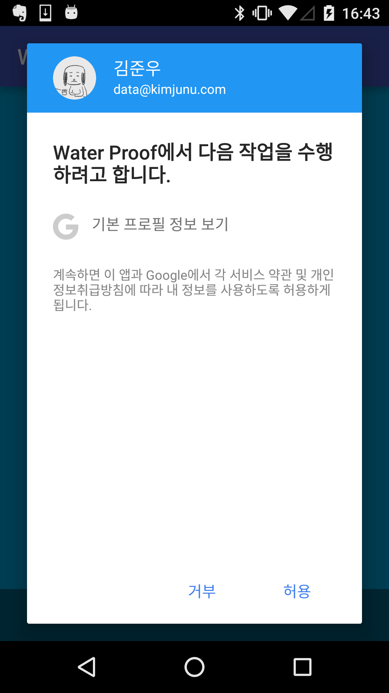

[구글 공식 가이드](https://firebase.google.com/docs/auth/android/google-signin#before_you_begin)

지난주에 Firbase 스터디를 참가했다.
Firebase에 관심이 생겨 혼자서 뚝딱뚝딱 만드는 것보다 서로 시행착오들을 공유하면서 공부하며 배우는 게 더 좋을듯했다.
서로 만들고싶은 프로젝트를 공유했는데, 난 만들고있는 게임의 리더보드를 만들고싶었다.
Authentication, Realtime Database, 여력이 된다면 Cloud Messaging 기능이 필요한 것 같아 구글 공식 가이드 페이지를 보며 Authentication을 구현했다.

3년 전에 baas.io를 처음 사용해봤다.
지금은 서비스 종료된 baas.io는 플랫폼에 관계없이 푸쉬메시지, 스토리지, 계정 관리, 고객센터 기능을 지원했었다.
구글의 firebase는 baas.io보다 기능이 많고 잘 만들어졌음에도 불구하고 baas.io만큼 쉽게 적용할 수 있었고, 콘솔 인터페이스도 괜찮다는 느낌이 들었다.

구글 공식 가이드 페이지를 따라가니 금방 적용이 가능했다.
그러나 빌드가 완료되고 실행하고나서 다음 에러를 만
났다.


Failed to load module descriptor class: Didn't find class “com.google.android.gms.dynamite.descriptors.com.google.firebase.auth.ModuleDescriptor"



알고보니 SDK Manager에서 Google Play Service를 설치하지 않았기 때문이었다.
그리고 안드로이드 기기에서도 Google Play Service를 최신버전으로 업데이트해야했다.
그것 외엔 별 문제가 없었다.

Authentication 기능을 완료한 다음에는 Realtime Database로 점수를 저장하고, 보여주고, 업데이트하는 기능을 만드려고 한다.
Firebase 편하고 좋다.

