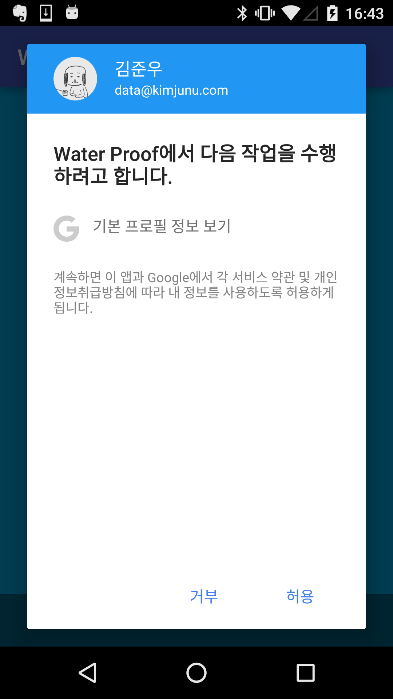

[https://github.com/datakun/WaterProof](https://github.com/datakun/WaterProof)

1. Firebase를 이용하여 게임의 리더보드를 만들었다.
ListView를 이용하여 자신보다 점수가 높은 10명과 낮은 10명의 프로필사진, 유저이름, 점수를 보여주는 것이 목표다.
Database에 대해 여러가지 시도를 해봤다.
액티비티에 데이터베이스 관련 함수와 리스너를 다 넣을지, 따로 컨트롤러를 만들지 많은 고민을 했다.
결론은 Application 클래스에 각 액티비티에서 접근할 메서드와 리스너를 만들어 클래스 내부에서 데이터베이스 처리를 한 뒤에 리스너를 호출하도록 만들었다.
만들다보니 Application 클래스 소스코드를 읽기 힘들 것 같다는 생각이 들었다.
대신 각 액티비티의 코드는 짧아졌다.

2. ListView를 쓰다보니 메모리관리가 제대로 되지않는것 같다.
Resource Monitor를 확인해보니 액티비티에서 ListView를 만들때마다 allocated 메모리가 늘어났고, 한계까지 메모리가 찼을때는 이전의 메모리를 해제했다.
이것이 자바의 방법이라 생각하지만 좀 더 스마트한 방법이 없을까 찾아보았다.
구글링을 해보니 ListView보다 좀 더 유연하고 성능이 좋은 RecyclerView를 이용하는 법이 나왔다.
언젠간 ListView 대신 RecyclerView를 이용하는 방법을 적용해야겠다.

