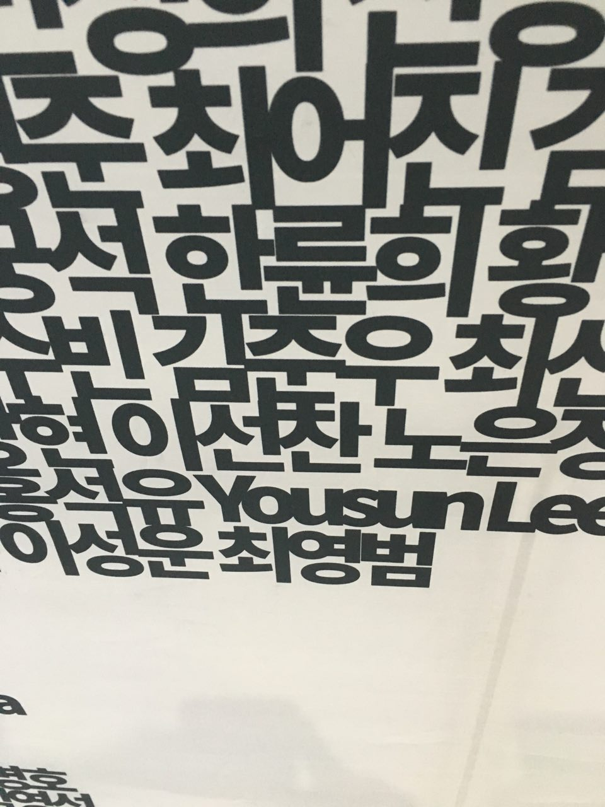
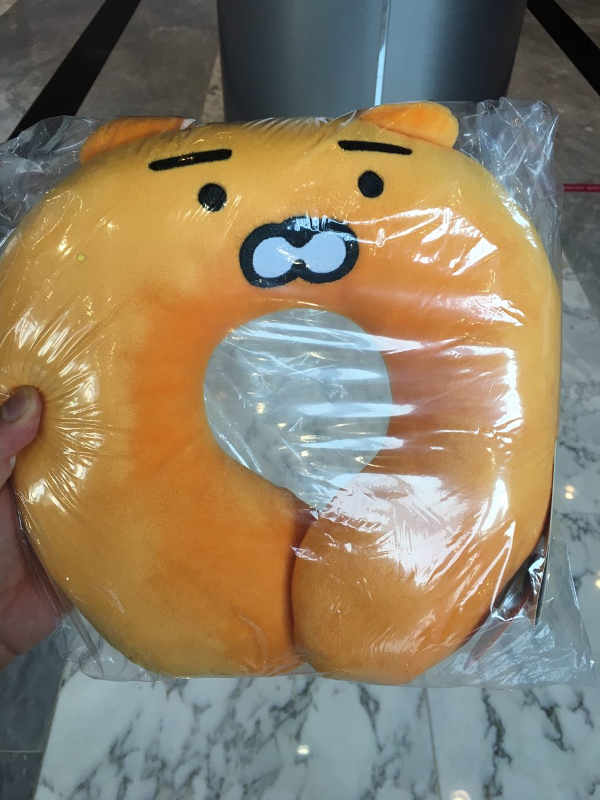
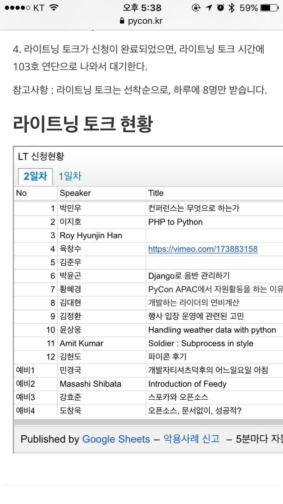

[Pycon APAC 2016](https://www.pycon.kr/2016apac/)

1. 부산에서 소스코드 리딩 모임(주로 파이썬)을 3년째 진행하고있는데,
개발자 페스티벌(이라고 표현하고싶다)을 처음 참가했다.
부산에서도 GDG에서 주최한 행사가 몇 번 있었지만 사정상 참가하지 못해서 아쉬웠다.
기대를 많이했고, 당연히 만족했다.
발표 프로그램 외에 오픈 스페이스 토크 프로그램이 좋았고,
하루의 끝에서 하는 라이트닝 토크도 좋았다.
물론, 가장 좋았던 건 티셔츠였다.
내게 맞는 사이즈가 있을까 걱정했지만,
4XL까지 준비되어있다는 말에 마음이 놓였다.

2. 가장 인상 깊던 프로그램은 [어느 흔한 파이썬 개발자의 집 소개](https://www.pycon.kr/2016apac/program/45) 이다.
올해 소스코드 리딩의 주제가 라즈베리파이로 스마트홈(비스무리한그)을 구축하는 것인데,
우리의 주제의 업그레이드 버전을 진행하다 망한 이야기를 들을 수 있어서 좋았다.
(현재 완성이 안된 것을 망했다고 표현했지만 9월 2일에는 완성이 될 것이고, 10월에는 경험담을 공유할 것이라고 한다)
발표가 끝난 뒤 개설된 오픈 스페이스 토크에 참여하여 발표 내용 외에 지식도 공유하고 여러 이야기들을 들을 수 있어서 더욱 좋았다.

3. 하나 아쉬운 점은 오픈 스페이스 토크 등록을 메인홀 쪽 게시판에서 할 수 있는데,
게시판을 보고 해당 방을 찾아가면 사람들이 없거나
수시로 추가되어 오픈 스페이스 등록 현황을 어디서나 확인 할 수 없어서 불편했다.
잦은 변화가 있고, 참여도를 높이려면 개설이 쉬워야(포스트잇을 붙이는 것으로 끝. 참 쉽죠?)하는게 문제라
웹페이지나 다른 등록 방법을 통해 개설하는 것은 동의하지않는다.
그러나 열린 스페이스 토크를 홍보하고 싶은 사람 혹은 나같은 행인 3이 챗봇(슬랙, 텔레그램, 지터 등등등등등)에
호실, 시간, 주제를 입력하는 것으로 웹서버에 저장된다면 어디서든지 확인할 수 있어서 좋을 것 같다.
(오용에 대해 생기는 몇 가지 문제점이 떠오르지만 생략했다)

4. 기회가 있을 때 다른 개발자 페스티벌을 참가해야겠다. 

p.s. 가능성은 낮겠지만 부산에서도 파이콘이 열린다면 좋겠다.
(아무래도 비용이 많이 들겠지)

p.s.#2 13일 저녁 먹고 집에 와서 Flask, Google App Engine, Telegram을 이용해서 봇을 만들어 OST를 확인 할 수 있는 기능을 14일 써보려고했지만,
완성하지 못해서 쓰지는 못했다.
그래도 텔레그램 봇을 만드는 방법,
Flask를 Google App Engine에 배포하는 방법,
Python으로 NDB를 사용하는 방법을 알게되었다.

p.s.#3 github으로 새 파일을 생성할 때,
제목을 입력하다가 실수해서 백스페이스 혹은 맥의 delete를 누르면 이상한 위치에서 지우기를 수행하는데,
이 부분이 수정된 것 같다.
제목을 입력할 때 부담감을 덜 가져서 돼서 좋다.
