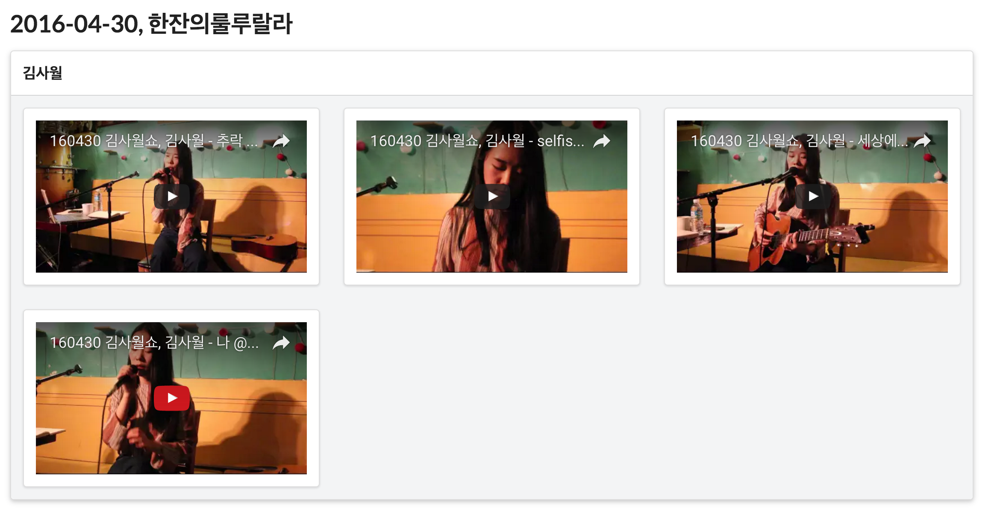

[목표](/F_GAE)

1. Python 3.5.1 Flask, MongoDB, Twitter API, YouTube Data API 를 이용하여 Indie Setlist 1차 버전을 완성했다.
현재 구현한 기능은 일정 기간마다 공연 정보 수집,
아티스트의 공연 영상 정보 수집,
공연 정보를 바탕으로 공연 영상 목록 보여주기를 구현했다.
일부 작업(공연 영상 수집을 위한 아티스트 이름 입력)은 수동으로 해야하지만 나머지는 봇이 하도록 구현했다.
목표는 어제 끝내서 동작 영상 만들고 구글핵페어에 참가하는 것인데, 시간을 맞추지 못했다. 아쉽다.

2. 단순히 Twitter API를 이용해서 공연 정보를 수집하려했지만, 인디스트릿의 트윗 내용으로는 정확한 일자를 알 수 없었다.
(내일 공연, 오늘 공연, 토요 공연 등으로 나타나있다.)
그래서 '내일', '오늘' 등의 단어로 정확한 공연 일자를 계산했다.
그러나 새벽 1시~2시 쯤에 작성한 트윗은 정확한 공연 일자를 제공하지 못해서 제외시켰다.

3. YouTube Data API를 사용하는 건 간단했다.
하지만 검색 결과가 많아서 원하는 결과만 필터링하는 작업이 시간이 좀 걸렸다.
먼저, 6가지 검색 문장을 만들어 유사한 결과를 얻어 목록을 만들었다.
영상 제목에서 날짜 문자열을 정규식으로 추출하여 공연 일자를 얻었고,
공연 장소와 영상 제목의 유사도를 비교하여 임계치를 넘어서면 공연 장소로 확정지었다.
이렇게 구성된 영상 목록에서 아티스트, 공연 장소, 공연 일자로 검색한 영상은 거의 확실한 공연 영상으로 보여준다.
다음으로 아티스트, 공연 일자로 검색한 영상은 아마도 공연하지 않았을까 하는 영상으로 보여준다.

4. 내가 좋아하는 아티스트의 지난 공연의 셋리스트를 보기 위해 이런 서비스는 없는지 검색해봤으나 국내에는 없어서 직접 만들었는데,
내가 생각한대로 결과를 보여줘서 재밌었다.
앞으로 고도화 작업이 필요하고,
라즈베리파이에 이식하는 작업도 필요하고,
UI를 조금 더 편하게 이용할 수 있도록 개선해야한다.
공연 영상 정보를 수집하는 것도 일정 기간마다 봇이 수행하도록 구현해야한다.

