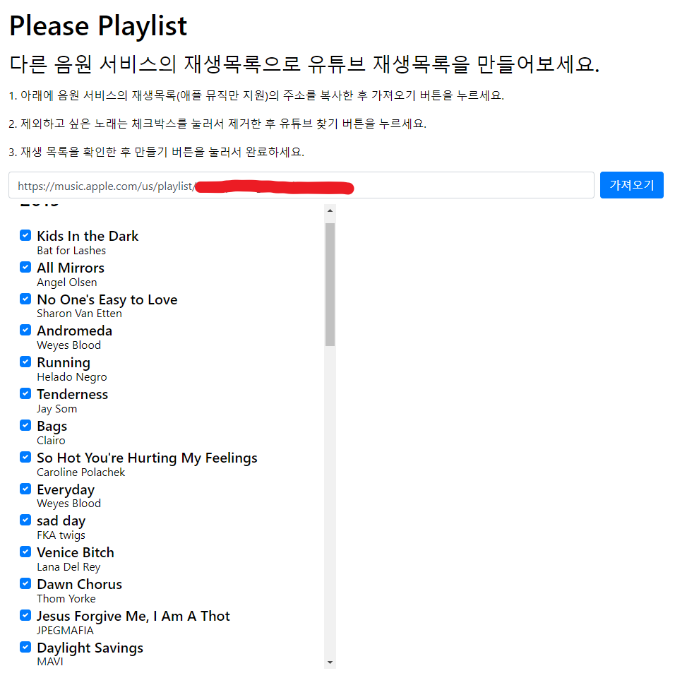

[Please Playlist GitHub](https://github.com/datakun/PleasePlaylist)

애플 뮤직에는 내 취향의 재생목록들이 많다. 안드로이드 유저가 된 후로 애플 뮤직은 안쓰게 됐는데, 재생목록 만큼은 포기할 수가 없었다. 처음에는 재생목록에 있는 곡들을 전부 복사해서 텍스트 에디터에 붙여넣기 한 다음에 파싱과 문자열 바꾸기를 적절하게 수행해서 곡명과 가수명으로 정리한 다음에 유튜브나 VIBE 앱으로 재생목록을 만들어서 하나씩 곡을 추가 하는 작업을 했었다. 하지만 어떤 재생목록은 4, 50 곡은 넘게 들어 있어서 작업을 포기한 적도 있다. 그나마 다행으로 VIBE 앱에서는 재생목록을 캡쳐해서 불러오기하면 알아서 추가해주는 기능이 있는데, 곡 수가 많으면 재생목록을 여러 장 캡쳐하는 것도 일이라 좀 더 쉬운 방법을 찾게 됐다. 유튜브 뮤직은 재생목록을 만들어주는 API를 제공해서 애플 뮤직에서 재생목록을 잘 가져와서 곡명과 가수명만 잘 뽑아낸다면 유튜브 재생목록을 만들 수 있지 않을까 생각해서 개발하기로 했다.(*VIBE에 재생목록을 만들어주는 네이버 API가 있는지 찾아보니 없었다. 혹시 관계자가 이 글을 본다면 VIBE도 외부에서 접근 가능한 API를 제공해주면 좋겠다. 혹은 직접 개발하고 싶다.*)

애플 뮤직의 재생목록은 URL로 공유 가능하다. 웹 브라우저로 해당 URL로 접근하면 애플 홈페이에 곡 이름과 가수, 앨범 커버 이미지 등이 나온다. 왠지 파이썬으로 스크래핑하면 쉬울 것 같아서 크롬 개발자도구로 DOM을 살펴봤다. 필요한 건 곡명과 가수명이라서 곡명으로 검색하니 곡명을 감싼 HTML 태그가 바로 나왔다. 적절한 id와 class 값을 찾은 후, BeautifulSoup으로 곡명과 가수명을 가져와봤는데, 한 번에 성공했다. 애플 뮤직의 재생목록을 가져왔으니 웹페이지를 만들어 보고 싶었다. 디자인에 큰 에너지를 쏟지 않기 위해 Bootstrap을 이용했고, CSS와 조금 싸우고 난 후 애플 뮤직 재생목록만 보여주는 1차 버전을 만들었다.

다음에 구현해야 하는 것은 유튜브에서 곡명, 가수명으로 영상을 검색하고 해당 영상들을 모아서 재생목록 초안을 만들어서 웹페이지에 보여준 후 사용자가 확인하면 유튜브 재생목록으로 만들어주는 기능이다. 근데 걱정이 되는 점이 있는데, ***1. 애플 뮤직에서 웹 스크래핑을 막지 않을까? 2. 영상을 찾기 위해 API를 사용하다보면 이전에 IndieSetList 만들 때처럼 사용 제한이 걸리지않을까?*** 하는 점이다. 일단 완전한 서비스를 구현한 뒤에 해당 문제가 발생하면 더 고민해봐야겠다.

나중에 애플 뮤직에서 재생목록을 가져오는 것을 구현하고 나면 스포티파이 재생목록을 가져오는 기능도 구현하려고 한다. 스포티파이에도 취향에 맞는 재생목록이 많았다.

이미 비슷한 기능을 하는 서비스들이 있는데, 무료 서비스는 없었다. 그래서 직접 개발해보기로 했다. 아마도 API를 사용하려면 애플 개발자 프로그램 등록, 구글 API 사용한도 증가 때문에 서비스 비용을 받는게 아닌가 생각한다.
